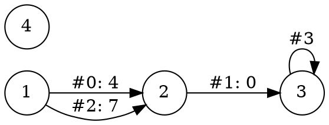

# Graphvis Debug Hpp

基本调用方式：

```cpp
graphviz::dump_graph(n, edges);             // 默认输出到 cout
graphviz::dump_graph(n, edges, std::cerr);  // 输出到 cerr
graphviz::dump_graph(n, edges, fout);       // 输出到你创建的文件流

std::string dot = graphviz::to_dot(n, edges);  // 直接获取 DOT 字符串
```

下面在你的代码上增加了 **0/1 起始编号、可选边编号、横向布局**，并保留输入校验和输出错误检查。

## 1. 完整实现

使用 **C++17**。可以直接保存为头文件：[graphviz_debug.hpp](sandbox:/mnt/data/graphviz_debug.hpp)。

```cpp
#pragma once

#include <cstddef>
#include <iostream>
#include <optional>
#include <sstream>
#include <stdexcept>
#include <string>
#include <string_view>
#include <vector>

namespace graphviz {

struct Edge {
    int u, v;
    std::optional<long long> w = std::nullopt;
};

struct Options {
    bool directed = false;
    int index_base = 1;             // 只接受 0 或 1
    bool left_to_right = false;     // dot 引擎：横向布局
    bool show_edge_ids = false;     // 显示 edges 中的下标，从 0 开始
};

// 仅借用 out：不关闭流，也不主动调用 flush。
// 无向图要求每条实际边只传入一次；不会自动去重。
inline std::ostream& dump_graph(
    int n,
    const std::vector<Edge>& edges,
    std::ostream& out = std::cout,
    const Options& opt = {}
) {
    if (n < 0)
        throw std::invalid_argument("graphviz: n must be nonnegative");

    if (opt.index_base != 0 && opt.index_base != 1)
        throw std::invalid_argument("graphviz: index_base must be 0 or 1");

    // 合法编号区间：[index_base, index_base + n)。
    // 转成 long long 后相加，避免 n + 1 的 int 溢出。
    const long long end = static_cast<long long>(n) + opt.index_base;
    const auto valid = [&](int v) {
        return v >= opt.index_base && static_cast<long long>(v) < end;
    };

    // 先检查全部输入，避免发现非法边时已经输出了一半。
    for (std::size_t i = 0; i < edges.size(); ++i) {
        const auto& e = edges[i];
        if (!valid(e.u) || !valid(e.v)) {
            throw std::out_of_range(
                "graphviz: invalid endpoint in edge #" + std::to_string(i)
                + " (" + std::to_string(e.u)
                + ", " + std::to_string(e.v) + ")"
            );
        }
    }

    if (!out)
        throw std::runtime_error("graphviz: output stream is not writable");

    // 数字先转成十进制字符串，再用非格式化输出写入。
    // 不受调用者的 std::hex、std::setw 等设置影响。
    const auto emit = [&](std::string_view text) {
        out.write(text.data(), static_cast<std::streamsize>(text.size()));
        if (!out)
            throw std::runtime_error("graphviz: failed to write DOT");
    };

    emit(opt.directed ? "digraph G {\n" : "graph G {\n");
    emit(opt.left_to_right ? "  rankdir=LR;\n" : "  rankdir=TB;\n");
    emit("  node [shape=circle];\n");

    // 显式输出所有点，包括孤立点。
    for (int i = 0; i < n; ++i)
        emit("  " + std::to_string(i + opt.index_base) + ";\n");

    const char* edge_op = opt.directed ? " -> " : " -- ";

    for (std::size_t i = 0; i < edges.size(); ++i) {
        const auto& e = edges[i];
        std::string line = "  " + std::to_string(e.u)
                         + edge_op + std::to_string(e.v);

        std::string label;
        if (opt.show_edge_ids)
            label = "#" + std::to_string(i);

        if (e.w.has_value()) {
            if (!label.empty())
                label += ": ";
            label += std::to_string(*e.w);
        }

        if (!label.empty())
            line += " [label=\"" + label + "\"]";

        line += ";\n";
        emit(line);
    }

    emit("}\n");
    return out;
}

// 需要字符串时，复用同一套输出逻辑。
inline std::string to_dot(
    int n,
    const std::vector<Edge>& edges,
    const Options& opt = {}
) {
    std::ostringstream out;
    dump_graph(n, edges, out, opt);
    return out.str();
}

} // namespace graphviz
```

这份代码已通过 C++17 编译和测试，覆盖了空图、孤立点、重边、自环、零/负边权、非法编号及输出失败；生成的示例 DOT 也已通过本地 Graphviz 解析。

## 2. 常用方式

### 输出到标准输出，复制到在线网站

```cpp
std::vector<graphviz::Edge> edges = {
    {1, 2, 4},
    {2, 3, 0},   // 权重为 0
    {1, 2, 7},   // 重边
    {3, 3}       // 无权自环
};

// 默认：无向图，节点编号 1..4。
graphviz::dump_graph(4, edges);
```

这里会输出节点 `4`，即使它没有连接任何边。

需要有向图及更多调试信息时：

```cpp
graphviz::Options opt;
opt.directed = true;
opt.left_to_right = true;
opt.show_edge_ids = true;

graphviz::dump_graph(4, edges, std::cout, opt);
```

输出：



`#0: 4` 表示 **`edges[0]`，边权为 `4`**。边编号始终对应 `vector` 的下标，不随节点的起始编号改变。

`left_to_right` 对应 DOT 的 `rankdir=LR`，用于让 `dot` 引擎横向布局；它不是改变边方向，也不适用于所有布局引擎。([Graphviz][2])

### 自己管理文件流

```cpp
#include <fstream>

std::ofstream fout("graph.dot");
if (!fout)
    throw std::runtime_error("Cannot open graph.dot");

graphviz::dump_graph(4, edges, fout, opt);

// 文件由你打开，也由你决定何时关闭。
fout.close();
if (!fout)
    throw std::runtime_error("Cannot finish writing graph.dot");
```

**`dump_graph` 不负责关闭你传入的流。** 它会检查当前写入是否失败，但文件关闭阶段仍可能出现错误，因此需要确认文件写入完成时，保留 `close()` 后的检查。([Eel][1])

### 获取字符串，或者改成 0 起始编号

```cpp
// 获取字符串，用于后续处理。
std::string dot = graphviz::to_dot(4, edges, opt);

// 也可以直接传入自己的字符串流。
std::ostringstream buffer;
graphviz::dump_graph(4, edges, buffer, opt);
std::string another_dot = buffer.str();
```

`std::ostringstream` 将输出保存在字符串缓冲区中，`str()` 用于取出其内容。([Eel][3])

节点编号为 `0..n-1` 时：

```cpp
std::vector<graphviz::Edge> zero_edges = {
    {0, 1, 10},
    {1, 2, -3}
};

graphviz::Options zero_opt;
zero_opt.index_base = 0;

graphviz::dump_graph(3, zero_edges, std::cout, zero_opt);
```

## 3. 这版实现里值得保留的两个细节

**第一，不让调用者的输出格式影响 DOT。**

例如，你之前可能写过：

```cpp
std::cout << std::hex;
```

这版代码先将节点编号和边权转为十进制字符串，再通过非格式化输出 `write()` 写入，不依赖流的数值格式，也不会改动调用者的格式设置。`write()` 本身属于非格式化输出操作。([Eel][4])

**第二，不自动去重。**

你的边集里有两条相同端点的边，可能是邻接表双向存储造成的重复，也可能是题目真正允许的重边；函数无法替你判断，所以按传入的边逐条输出，也没有添加会禁止重边的 `strict`。([Graphviz][5])

因此，**传入无向图时，每条实际边只传一次；真正的重边则各传一次。**

对你的日常使用，最常用的两行就是：

```cpp
graphviz::dump_graph(n, edges);             // 输出后直接复制
graphviz::dump_graph(n, edges, std::cerr);  // 将图的调试输出与答案分开
```

[1]: https://eel.is/c%2B%2Bdraft/ofstream "[ofstream]"
[2]: https://graphviz.org/docs/attrs/rankdir/ "rankdir | Graphviz"
[3]: https://eel.is/c%2B%2Bdraft/ostringstream "[ostringstream]"
[4]: https://eel.is/c%2B%2Bdraft/ostream.unformatted "[ostream.unformatted]"
[5]: https://graphviz.org/doc/info/lang.html "DOT Language | Graphviz"
